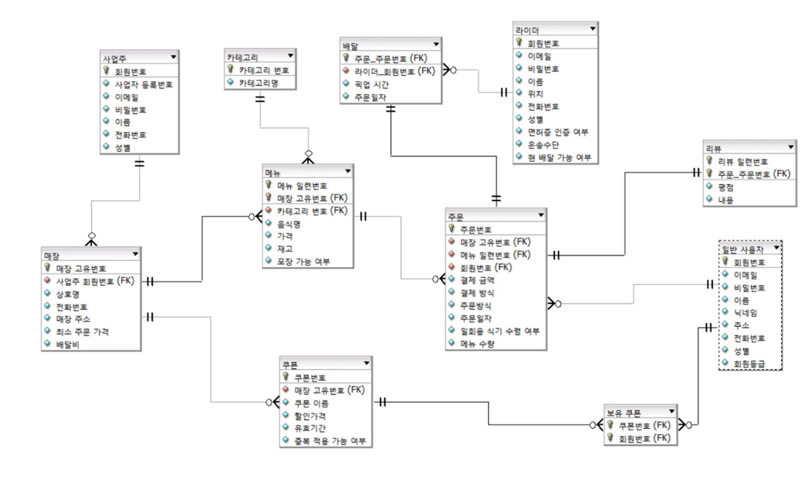

# 🚚 Wagu: 음식 배달 데이터베이스 설계 프로젝트

**설명:** 음식 배달에 대한 데이터베이스를 설계한 후 간단한 시뮬레이션 데스크톱 애플리케이션입니다.

## 프로젝트 정보

- **개발 기간:** 2023-11-12 ~ 2023-12-16
- **핵심 역할:** 제안서, 테이블 정의서, 업무 분석서 작성, SQLite Database 구축, Python 애플리케이션 개발
- **개발 언어:** Python, SQL
- **개발 도구:** VSCode, PyQT, SQLite, DB Designer

## ERD

## 데이터베이스 관련 문서

[제안서](documents/Wagu_제안서.pdf)  
[업무분석서](documents/Wagu_업무분석서.pdf)  
[테이블정의서](documents/Wagu_테이블정의서.pdf)  
[발표자료](documents/Wagu_발표자료.pdf)  
